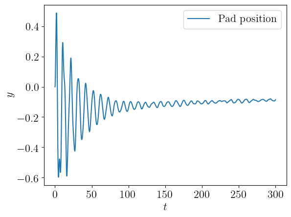

## Welcome to the webpage for the Burrdige-Knopoff-Pad-Model
  _Created as a part of the Masters Thesis of Thea Marstrander._

This webpage will show the animations made from simulations of the Burridge-Knopoff-Pad-Model. 
It will also supplement with plots of the respective simulations.
There will be given short intepretations of what can be viewed in the animations, but for further analisys see the full thesis.

The webpage repository:
Model repository:

[Mode shape figures](modeShapes.md)

[a relative link](friction.html)

