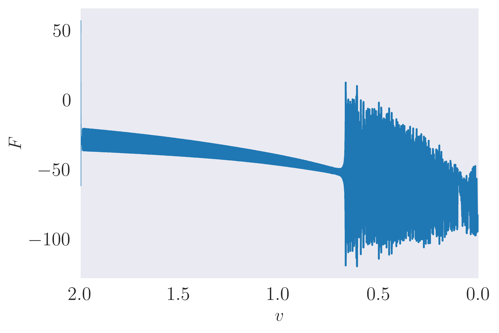

## Welcome to the webpage for the Burrdige-Knopoff-Pad-Model
  _Created as a part of the Masters Thesis of Thea Marstrander._

This webpage serves as an extended appendix for the master thesis on the Burrdige-Knopoff-Pad Model.

[Mode shape figures, BKP model](modeShapes.md)

[Mode shape figures, BK model](modeShapesBK.md)

[Seed figures](seedFigures.md)

