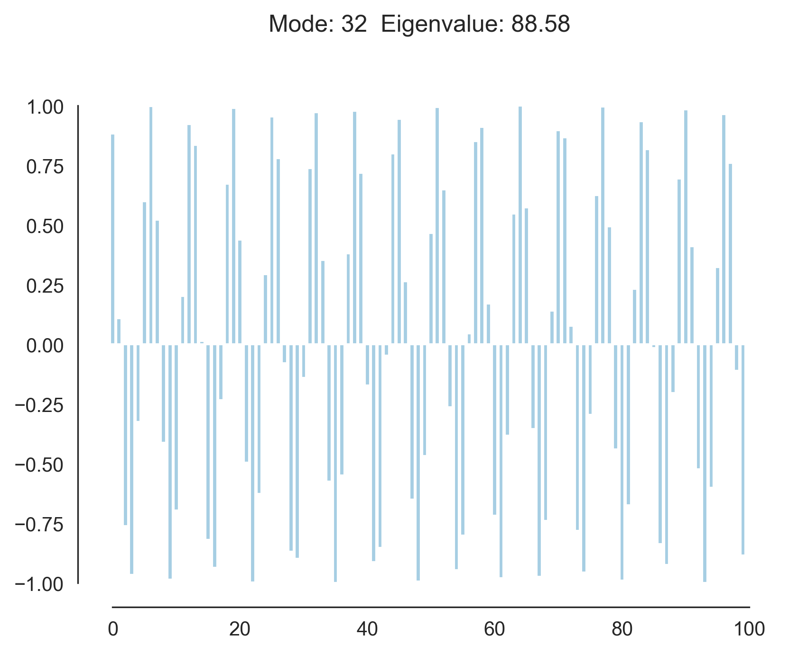

## Mode shape figures

Each image below shows the mode shape/eigenvector for each mode, created using 100 blocks. 
Each bar represents each value in the eigenvector corresponinding the eigevalue in the image header. 
The first 100 bars from the left in each figure represents each of the 100 blocks, while the last bar represents the pad. 
For further interpretation, view the dissertion.  

